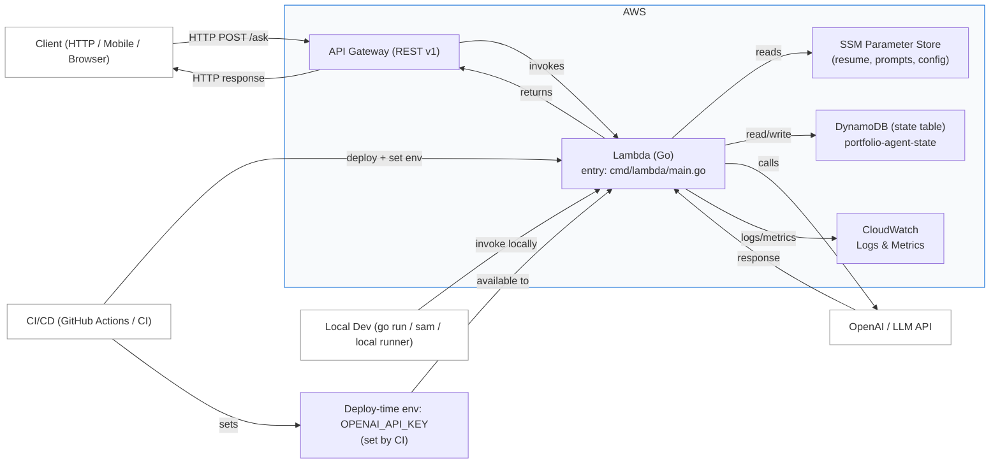

# Architecture (ARCH)

```mermaid
flowchart LR
  %% External actors
  Client["Client (HTTP / Mobile / Browser)"]
  OpenAI["OpenAI / LLM API"]
  CI["CI/CD (GitHub Actions / CI)"]
  Local["Local Dev (go run / sam / local runner)"]

  subgraph AWS [AWS]
    direction TB
    APIGW["API Gateway (REST v1)"]
    Lambda["Lambda (Go)\nentry: cmd/lambda/main.go"]
    SSM["SSM Parameter Store\n(resume, prompts, config)"]
    DDB["DynamoDB (state table)\nportfolio-agent-state"]
    CW["CloudWatch\nLogs & Metrics"]
  end

  Env["Deploy-time env: OPENAI_API_KEY\n(set by CI) "]

  %% Core request flow
  Client -->|HTTP POST /ask| APIGW
  APIGW -->|invokes| Lambda
  Lambda -->|reads| SSM
  Lambda -->|read/write| DDB
  Lambda -->|calls| OpenAI
  OpenAI -->|response| Lambda
  Lambda -->|logs/metrics| CW
  Lambda -->|returns| APIGW
  APIGW -->|HTTP response| Client

  %% Operational/infra flows
  CI -->|deploy + set env| Lambda
  CI -->|sets| Env
  Local -->|invoke locally| Lambda
  Env -->|available to| Lambda

  %% Notes
  style AWS fill:#f8fafc,stroke:#0366d6,stroke-width:1px
  classDef extActor fill:#ffffff,stroke:#999,stroke-width:1px
  class Client,OpenAI,CI,Local extActor
```
